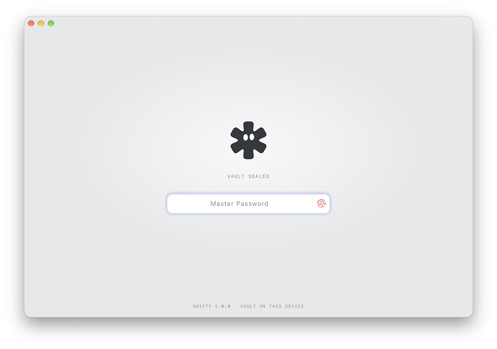
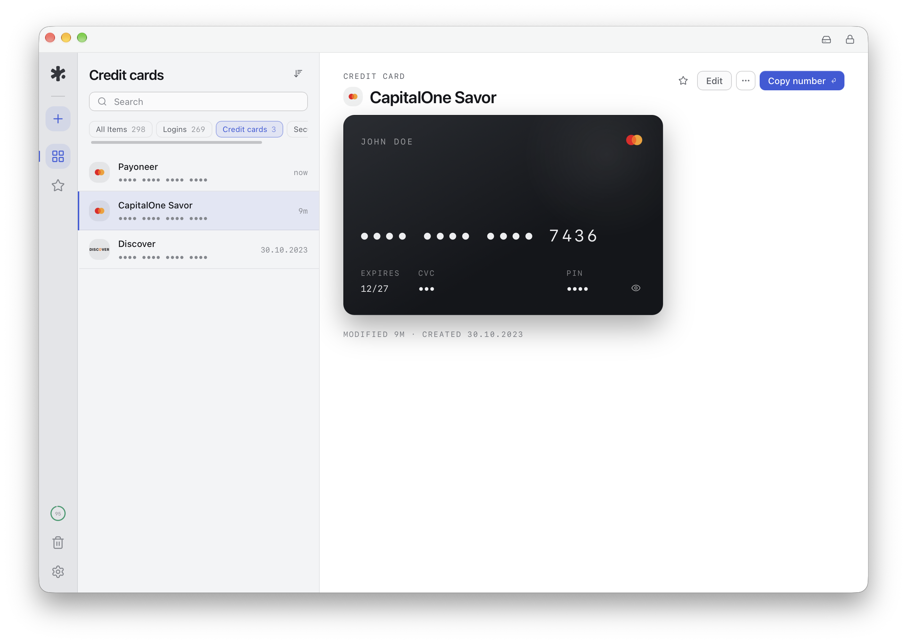

## Free Offline-first Password Manager for MacOS, Windows and Linux.

<div align="center">
  
  [](https://www.paypal.me/alchaplinsky)
  
  [](https://github.com/swiftyapp/swifty/actions)
  [](https://opencollective.com/swifty) 
  
  [](https://tools.ietf.org/html/rfc5288)
  
</div>

❤️ it? Then ⭐️ it on GitHub or Tweet about it.

## Features

- Store Login/Password credentials
- Credit card Information 
- Secure notes to store sensitive information
- One-click Strong Password Generation
- Time-based One Time Passwords support (TOTP)
- Google Drive Sync (optional)
- No data is leaving your computer:
  - Your vault is a locally stored, encrypted SQLite database (SQLCipher); each
    entry's secrets are sealed in an extra application-level AEAD layer
  - Secrets stay encrypted at rest and in memory, decrypted only when you reveal
    or copy them
  - Ability to migrate from one computer to another using backup file or GDrive sync
- There's more to come...

## Screenshots





## Install

Check the [Latest Releases](https://github.com/swiftyapp/swifty/releases) page for the
most recent packaged app for MacOS, Windows or Linux.

## Verifying a release

Every release is built in GitHub Actions and ships with supply-chain evidence:

- **SLSA build provenance** — each installer is attested with
  [`actions/attest-build-provenance`](https://github.com/actions/attest-build-provenance)
  (keyless OIDC signing). You can prove an installer was built by this repo's
  workflow, from this source, with the [GitHub CLI](https://cli.github.com):

  ```bash
  gh attestation verify ./Swifty_1.0.0_amd64.AppImage --repo swiftyapp/swifty
  ```

  (works for the `.dmg`, `.msi`, `-setup.exe`, `.deb`, `.rpm` and `.AppImage`
  assets — point it at whichever you downloaded).

- **CycloneDX SBOM** — every release attaches `swifty-rust.cdx.json` (the full
  Rust dependency graph) and, when available, `swifty-js.cdx.json` (the
  frontend). Feed them to any CycloneDX-aware scanner (e.g. `grype sbom:./swifty-rust.cdx.json`)
  to audit the exact dependencies a build shipped.

- **Update signature** — the auto-updater only installs updates signed with the
  project's minisign key (public key in `src-tauri/tauri.conf.json`); the
  matching private key never leaves CI.

The Rust toolchain (`rust-toolchain.toml`) and the bun version are both pinned,
so builds are reproducible from a fixed toolchain.

## Development

Swifty is built with [Tauri 2](https://v2.tauri.app) (Rust backend + TypeScript/React/Vite frontend).

### Prerequisites

- [Node.js](https://nodejs.org) 20+
- [Rust](https://rustup.rs) (stable toolchain)
- Platform build dependencies for Tauri — see the
  [Tauri prerequisites guide](https://v2.tauri.app/start/prerequisites/)
  (on Linux: `libwebkit2gtk-4.1-dev libappindicator3-dev librsvg2-dev patchelf libgtk-3-dev`)

### Commands

```bash
git clone git@github.com:swiftyapp/swifty.git
cd swifty
npm install

npm run tauri:dev     # run the app in development
npm run tauri:build   # produce a signed, packaged build for the current OS

npm run build         # build the frontend only (tsc + vite)
npm test              # frontend unit tests (Vitest)
cd src-tauri && cargo test   # backend tests
```

## Configuration

### Google Drive sync (optional)

Drive sync uses **your own** Google OAuth **Desktop** client — no credentials
are bundled with the app. To enable it:

1. In the [Google Cloud Console](https://console.cloud.google.com) create an
   OAuth 2.0 Client ID of type **Desktop app**.
2. Enable the **Google Drive API** for the project.
3. The app requests the `https://www.googleapis.com/auth/drive.file` scope and
   listens on the loopback redirect URI `http://127.0.0.1:4567/auth/callback`.
4. Provide the credentials as environment/build variables when running or
   building:

   ```bash
   export GOOGLE_OAUTH_CLIENT_ID=your-desktop-client-id.apps.googleusercontent.com
   export GOOGLE_OAUTH_CLIENT_SECRET=your-desktop-client-secret   # optional
   ```

   They are read at runtime (`std::env::var`) and, if absent, fall back to the
   value baked in at compile time (`option_env!`). The build succeeds without
   them — sync simply reports "Google OAuth client not configured" until a
   client id is supplied.

### Auto-update signing

Release builds are signed for `tauri-plugin-updater`. The public key lives in
`src-tauri/tauri.conf.json`; the matching **private key is never committed** and
is provided to CI via the `TAURI_SIGNING_PRIVATE_KEY` (and
`TAURI_SIGNING_PRIVATE_KEY_PASSWORD`) secrets. Generate a keypair with
`npm run tauri signer generate -- -w ~/.swifty/updater.key`.

## Security

Swifty is offline-first: your vault is an encrypted SQLite database (SQLCipher)
on your own device, with each entry's secrets sealed in an additional
application-level AEAD layer, and there is no backend that holds your secrets.
See [`SECURITY.md`](SECURITY.md) for
how to report a vulnerability, and [`docs/threat-model.md`](docs/threat-model.md)
for what Swifty does and does not defend against.

## Contributors

### Code Contributors

This project exists thanks to all the people who contribute. [[Contribute](CONTRIBUTING.md)].
<a href="https://github.com/swiftyapp/swifty/graphs/contributors"></a>

### Financial Contributors

Become a financial contributor and help us sustain our community. [[Contribute](https://opencollective.com/swifty/contribute)]

#### Individuals

<a href="https://opencollective.com/swifty"></a>

#### Organizations

Support this project with your organization. Your logo will show up here with a link to your website. [[Contribute](https://opencollective.com/swifty/contribute)]

<a href="https://opencollective.com/swifty/organization/0/website"></a>
<a href="https://opencollective.com/swifty/organization/1/website"></a>
<a href="https://opencollective.com/swifty/organization/2/website"></a>
<a href="https://opencollective.com/swifty/organization/3/website"></a>
<a href="https://opencollective.com/swifty/organization/4/website"></a>
<a href="https://opencollective.com/swifty/organization/5/website"></a>
<a href="https://opencollective.com/swifty/organization/6/website"></a>
<a href="https://opencollective.com/swifty/organization/7/website"></a>
<a href="https://opencollective.com/swifty/organization/8/website"></a>
<a href="https://opencollective.com/swifty/organization/9/website"></a>

## License

GNU/GPL Version 3
